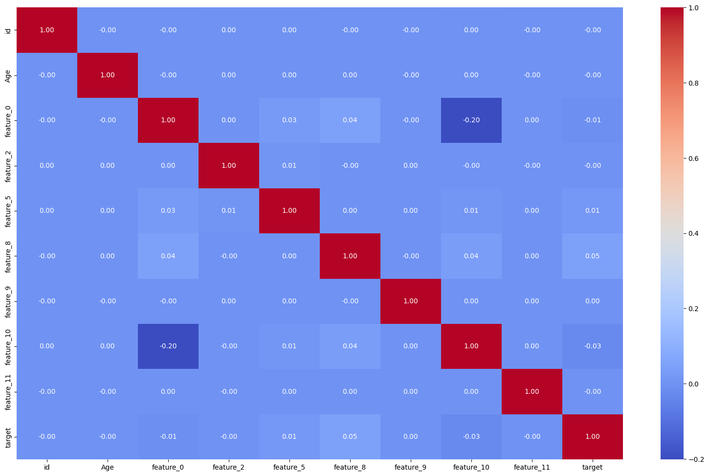

# Intro-to-ML

## Project Overview
This repository contains the final project for the **Introduction to Machine Learning (CSC14005)** course at VNU-HCMUS, Department of Computer Science. The project follows a comprehensive machine learning development cycle, structured into three iterative phases to solve a real-world problem through data analysis and modeling.

- **Data Link**: [Google Drive](https://drive.google.com/drive/u/0/folders/1ZIhnBlzOlJX3Eyz02nSwIlsxLP1dUJPK)
- **Kaggle Competition**: [IntroML CLC HK2 2024-2025](https://www.kaggle.com/competitions/introml-clc-hk2-2425/)
- **Deployment Link**: [Streamlit App](https://truongthuankiet1990gmailcom-intro-to-ml-app-du1wh5.streamlit.app/)

---

# 1. 📌Description
This project implements an end-to-end machine learning solution, leveraging frameworks like Scikit-learn, PyTorch/TensorFlow, and XGBoost/LightGBM/CatBoost to address a classification or regression task defined by the Kaggle competition. The development process began with exploratory analysis in Jupyter Notebooks, followed by modularizing the pipeline into components for data ingestion, transformation, and model training. These components were then automated into training and prediction scripts, incorporating best practices such as virtual environments, exception handling, logging, and detailed documentation. The final step involved deploying the solution as a Streamlit web application, mirroring a professional data science workflow.

---

# 2. ⚙️Technologies and Tools
- **Languages/Frameworks**: Python (Pandas, NumPy, Matplotlib, Seaborn, Scikit-learn, PyTorch, TensorFlow, XGBoost, LightGBM, CatBoost)
- **Development**: Jupyter Notebook, Git, GitHub
- **Environment**: Anaconda, Visual Studio Code
- **Deployment**: Streamlit

---

# 3.🎯 Project Objective

## 3.1 What is the Project Problem?
The project tackles a challenge posed by the Kaggle competition, such as predicting a target variable (e.g., customer behavior, classification outcome, or numerical value) based on the provided dataset. The goal is to develop a model that provides actionable insights or predictions to address a specific real-world issue.

## 3.2 What is the Context?
The dataset, sourced from the competition, contains features relevant to the problem domain. Key performance indicators (e.g., accuracy, error metrics, or domain-specific metrics) especially in this contest `RMSLE` is **the main scoring criteria** guide the evaluation of the solution, emphasizing the importance of robust modeling to maximize performance.

## 3.3 Project Objectives
1. Conduct thorough exploratory data analysis to understand data patterns and prepare it for modeling.
2. Develop and train multiple machine learning models using diverse frameworks and optimize their hyperparameters.
3. Evaluate model performance using appropriate metrics (e.g., accuracy, RMSE, AUC-ROC) and refine the solution for deployment.

## 3.4 Project Benefits
1. Provides a predictive tool for decision-making.
2. Enhances understanding of data through visualization and analysis.
3. Offers a scalable deployment for practical use.

## 3.5 Conclusion
The deployed model generates probability scores or predictions, offering more nuanced insights than binary outcomes. This enables targeted strategies, such as optimizing model inputs or focusing on high-impact features, to improve overall performance.

---

# 4. Solution Pipeline

## General EDA
### Dataset overview: 
The dataset consists of 1,200,000 training entries and 800,000 test entries, with 21 columns in the training set (including the target) and 20 in the test set. 
### Categorical Features Analysis:
- **Key observations:**
    - `Gender`: Slightly higher proportion of males compared to females.
    - `Feature_1 (Marital Status)`: Balanced distribution across categories (Married, Divorced, Single).
    - `Feature_3 (Education Level)`: Higher representation of individuals with Bachelor's and Master's degrees.
    - `Feature_4 (Employment Status)`: Majority are employed, followed by self-employed and unemployed.
    - `Feature_6 (Location Type)`: Balanced distribution across Urban, Rural, and Suburban.
    - `Feature_7 (Tier)`: Relatively balanced distribution across Basic, Comprehensive, and Premium tiers.
    - `Feature_14 (Binary Feature)`: Imbalance with more "No" than "Yes".
    - `Feature_16 (Housing Type)`: Balanced distribution across House, Apartment, and Condo.


- **Actions Taken:**
    - Identified strong predictors (e.g., Feature_3, Feature_7, Feature_13, Feature_15) based on clear ordinal trends with the target variable.
    - Planned encoding strategies:
        - **One-hot encoding:** Gender, Feature_1, Feature_4, Feature_6, Feature_16.
        - **Label encoding:** Feature_14.
        - **Ordinal encoding:** Feature_3, Feature_7, Feature_13, Feature_15.
        - **Frequency encoding:** All categorical features.


### Numerical Features Analysis
- **Key Observations:**
    - Outliers:
        - Detected in Feature_0 and Feature_8 using box plots.
        - Planned to apply log transformation to handle outliers.
        

    - Distributions:
        - Most numerical features (e.g., Age, Feature_0, Feature_5) are normally distributed.
        - Target and Feature_0 are skewed, requiring log transformation.
    
    - Correlations:
        - Weak correlations between most features and the target variable.
        - Feature_10 has the strongest negative correlation with the target (-0.20).
        - Feature_8 has a very weak positive correlation with the target (0.05).
        - Minimal multicollinearity observed between features.
- **Actions Taken:**
    - Planned log transformation for skewed features (Target, Feature_0).

### Missing Values Analysis
- **Objective:** Handle missing values effectively without losing valuable information.
- **Key Observations:**
    - Missing values are present in both numerical and categorical features.
    - NAN values in some features (e.g., Feature_1, Feature_4) provide additional information and should not be naively imputed.

- **Numerical features vs nan:**

    
    
    

- **Categorical features vs nan:**
    
    

- **Actions Taken:**
    - **For numerical features:**
        - Added a new column to indicate missing values (e.g., is_feature_na).
        - Imputed missing values with reasonable estimates (e.g., mean or median).
    - **For categorical features:**
        - Added a new column to indicate missing values.
        - Imputed missing values with the most frequent category or a placeholder (e.g., "Unknown").
### Feature Engineering
- Extracted date, month, and year from time-related features (e.g., Feature_12).
- Applied `sine` and `cosine` transformations to capture cyclical patterns in time-related features.

### Correlation Analysis
- Weak correlations between most features and the target variable.
- Feature_10 has the strongest negative correlation with feature_0 (-0.20).
- Feature_8 has the strongest positive correlation with the target (0.05).



## Phase 1: Scikit-learn
### Step 1: Preprocessing

- First we create periodic features from feature_12.
- Fill missing values, if numerical, then fill by median values, if categorical, then fill by Unknown values.
- Encode categorical feature and log-transform target feature, the reason why we logged the target is that:
    - **Alignment with the Metric:** RMSLE measures errors in the log space (log(1+y)). By taking the mean in the log space and exponentiating back, you’re finding the value that minimizes the squared logarithmic differences, which is exactly what RMSLE evaluates.
    - **Relative Errors:** RMSLE cares about relative errors (e.g., a 10% error is the same whether the true value is 100 or 10,000). The log transformation converts relative errors into additive differences, and the mean in this space corresponds to the geometric mean in the original space, which aligns with RMSLE’s focus on relative errors.

### Step 2: Model Development
We used only tree-based models, because:
-	From the EDA, we recognized that all features had no direct or linear relationships with target, which could be seen from the heatmap all correlation values were nearly 0.
-	Also, these models are less sensitive to feature scaling and from above preprocessing, we did a lot of processing of features.
-	Tree models are effective in handling missing values, although we already imputed missing values, if the imputation was imperfect, these models still provide an additional layer of robustness.
-	Last but not least, the time training for tree models is much lower than other models and the performance is much better, which can be seen from the evaluation part below.
#### Trick for training large datasets:

We knew that the size of the training set is 1.2M rows, which was pretty large, and in order to train on entire training set but still time-efficient, we chose [distributed training](https://docs.ultralytics.com/guides/model-training-tips/#pre-trained-weights).
-	Using parallel_backend with loky ensures efficient and scalable parallel processing for training the RandomForest model. It speeds up training, manages system resources effectively, and provides flexibility for switching backends if needed. This is particularly important for computationally expensive tasks like training ensemble models on large datasets.
    - **Speed Up Training with Parallel Processing**
        - RandomForestRegressor is an ensemble method that trains multiple decision trees independently.
        - By default, RandomForestRegressor supports parallel processing through the n_jobs parameter, which allows it to use multiple CPU cores to train the trees simultaneously.
        - Using parallel_backend('loky') ensures that the parallel processing is explicitly managed, potentially improving efficiency and resource utilization.
    - **Efficient Resource Management**
        - The loky backend is designed for process-based parallelism, which is more robust for CPU-intensive tasks like training decision trees.
        - It ensures that the training process does not interfere with other tasks running on the system by managing memory and CPU usage efficiently.
#### Training process
- Instead of using regular train test split, in this problem we used KFold with n_folds = 5 to cross-validate entire training dataset. Because we wanted to let the models learn as much as possible and to validate in the most comprehensive way possible.
- The params that were used for each model, had been hyper-tuned using Optuna (9:58 AM):	
    - Optuna uses advanced optimization algorithms like Tree-structured Parzen Estimator (TPE) and Bayesian Optimization to efficiently explore the hyperparameter space.
    - Unlike traditional grid search or random search, Optuna focuses on promising regions of the search space, reducing the number of trials required to find the best parameters.
-	After evaluating models and retrieving the most powerful models, we combined them by using **Voting Regressor** to combine. Since each model had strengths and drawbacks by taking average predicted values of each model can help utilize the characteristics of them.


### Step 3: Model Evaluation
#### RMSLE and RMSE


**Key observation**
-	Consistency Across Folds:
    Both models show consistent performance across all 5 folds, with minimal variation in RMSLE and RMSE values.
- This suggests that the models are stable but consistently underperforming.

**Poor Predictive Performance:**
- Both RMSLE and RMSE values are high for both models, indicating poor predictive performance.
- The high RMSLE values suggest that the models struggle with logarithmic-scaled predictions, while the high RMSE values indicate difficulty in predicting the actual scale of the target variable.

**Decision Tree vs. Random Forest:**
-	Decision Tree slightly outperforms Random Forest in both RMSLE and RMSE, but the difference is negligible.
-	Random Forest, being an ensemble method, is expected to perform better with proper hyperparameter tuning but turns out to contradict the theory.


## Phase 2 Gradient Boosting
### Step 1: Preprocessing
#### Feature Engineering
We do the same as Phase 1, instead in this Phase, we added **time features, interaction features, polynomial features**, … helped increasing the result a lot.
-	**Time features:**
    - **Group:**
        - Calculated as (year - 2020) * 48 + month * 4 + day // 7, creates a hierarchical temporal grouping. It combines year, month, and a weekly bin (day // 7) into a single feature. 
        - This feature aggregates time into a single numerical value, which can help the model identify trends over larger time periods.
-	**Interaction features:**
    - **Feature_0_feature_5, Feature_0_Age, Group_Age**
        - Since from the heatmap we knew that feature_0, feature_5 and feature_10 have the strongest correlation with target. Therefore, we tried many combinations and concluded that these are the strongest and the most effective features.
        - For Group_Age, after adding Group feature then using model to plot the feature importance, surprisingly when we tested this feature turned out to be the top tier feature that we would see on the feature importance of feature selection phase.
-	**Polynomial features:**
    - **Feature_0_squared, Age_squared**
    - As we said before, Age and Feature_0 have the strongest correlation with target, and after trials, these ones are the strongest features.
-	**Nan features:**
    - We knew that missing values have the important relationships with target and Gradient Boosting models like LightGBM and XGBoost can handle that.
    - Therefore, creating nan columns can preserve information about missingness.
-	**Frequency features:**
    - As we tested independently, we surprisingly discovered that these features somehow have great importance.
    - Also, maybe the number of unique values of each categorical feature is almost the same. So maybe this kind of encoding can help providing information for models.
#### Feature Selection
- From the experience of Phase 1, we realized trying to put too many features into models can cause noises and made models learn the wrong pattern. Therefore, we used LightGBM (the strongest model in this problem) to check feature importance:


&rarr; Surprisingly, we can see that most of categorical features have low importance. After many trials, we decided that threshold 200 is the optimal one for us to eliminate low important features.

### Step 2: Model Development
#### Training process
For the same process of Phase 1, we still do the same process as Phase 1. However, there are some different points during hyper-tuning process:
-	For all models, we used early stopping that is provided for each model to improve time training performance.
- Also, we used Optuna to hypertune as well.
-	The details of how early stopping initialized will be described below.
#### XGBoost
-	To use **early_stopping** in XGB, we gotta use DMatrix and Train of XGB because:
-	They offer greater flexibility for early stopping via callbacks.
-	**DMatrix** is more efficient for repeated training (e.g., in cross-validation).
-	They support advanced features like categorical handling and custom evaluation.
-	Early stopping reduces training time for poor hyperparameter sets, which is critical during tuning.
#### LightGBM
The same to XGBoost, to use early_stopping, we used train and Dataset:
- It optimizes data storage and processing, reducing memory and computation time during hyperparameter tuning with multiple folds and trials.
- It is required by lgb.train(), the native API used for training, which offers fine-grained control over the training process.
- It supports early stopping by defining validation sets, allowing the model to stop training when validation RMSE plateaus, saving time and reducing overfitting to minimize RMSLE.

#### Catboost
Different from 2 above models that used Dataset of their own to optimize time training, memory efficiency and early stopping, instead it has Pool, which:
- Efficient handling of categorical features, reduces memory overhead, speeds up training, and maintains consistency across folds. 
- Simplifies the code and leverages CatBoost's advanced capabilities, making it an essential component for optimizing model performance during hyperparameter tuning.
- Optimizes data storage and preprocessing, reducing computational overhead during hyperparameter tuning with multiple folds and trials.
- Supports early stopping by providing a validation set (val_pool) for monitoring RMSE, saving training time and preventing overfitting to minimize RMSLE.

### Step 3: Model Evaluation


**RMSLE:**
-	All three models (XGBoost, LightGBM, and CatBoost) have high RMSLE values, indicating poor performance in predicting logarithmic-scaled values.
-	LightGBM slightly outperforms CatBoost and XGBoost in RMSLE, but the improvement is minimal.

**RMSE:**
-	Similar to RMSLE, all three models exhibit high RMSE values, reflecting poor performance in predicting the actual scale of the target variable.
-	LightGBM and CatBoost perform slightly better than XGBoost in RMSE, but the differences are negligible.

## Phase 3 Neural Network
### Step 1: Preprocessing
-	Since neural networks are computationally intensive and require a long time to train, it's important to avoid using too many features.
-	Therefore, instead of applying a new preprocessing technique in phase 2, we will reuse the preprocessing approach from phase 1 to maintain efficiency.
#### DataLoading Process
-	To efficiently manage and feed data into a PyTorch neural network, we define a custom dataset class by extending the torch.utils.data.Dataset class.
-	This allows for clean integration with PyTorch's DataLoader, enabling batch processing, shuffling, and easy access to training, validation, and test data.
#### Train-Test Step
-	train_step function performs one epoch of training, including: forward propagation, calculate loss, backward propagation and evaluate on validation dataset.
-	After going through all the training dataset (1 epoch), we call the test_step function to evaluate the model on test dataset (which is a unseen dataset)
-	train_model function performs train_step and test_step alternatively for a number of epochs, returning evaluation metrics for us to track the performance of the model.

### Step 2: Model Development
#### Linear Model
First model is a simple feed forward Neural Network, called LinearModel, it consists of:
- Input layer with input dim equal to the number of the input features.
- Fully connected layers, they are connected linearly, might help detect linear relationships.
- No activation function.
- Output layer consists of 1 single neuron, designed for regression problems.	

#### Neural Network With Activation
The second model architecture is a more popular architecture, called RegressionModel, it consists of :
-	Input layer with input dim equal to the number of the input features.
-	Fully connected layers, with GELU activation function (smoother activation).
-	Batch normalization and drop out technique.
-	Output layer consists of 1 single neuron, designed for regression problems.

#### Neural Network With Skip Connection
Inspired by ResNet architecture, using skip connection technique, called ResidualNetwork. The model architecture consists of:
-	Input layer with the input dim equal to number of input features.
-	Multiple hidden layers made of Residual block, each block consists of ReLu activation function, skip connection and batch normalization technique.
-	Output layer with 1 neuron for regression problem.

Benefit of this architecture:
-	Improve gradient flow and help train deeper networks.
-	Helps reduce the vanishing gradient problem in deep networks.
-	Allows the model to learn identity mappings when needed (if the block learns nothing, it can just pass the input through).

#### TabNet Regressor
Attentive Interpretable Tabular Learning. Neural network architecture developed by Google AI, designed specifically for tabular data, module TabNetRegressor handles simple and and multi-task regression problems.

### Step 3: Model Evaluation


#### MAE and MSE and R2:
**Comparison Between Models:**
**Performance:**
- MAE :
    - The RegressionModel and ResidualNetwork has the lowest MAE in general.
    - The Linear Model has the lowest MAE.
- MSE:
    - ResidualNetwork also have the lowest MSE, probably captures general trends.
    - TabNetRegressor other models perform decently.
- R2:
    - All models have relative low R2.
    - ResidualNetwork have the best R2 score among all.
    - LinearModel and TabNetRegressor still perform the worst, barely explaining any variance, poor fit for complex data.
**Key Insights:**
- Linear Model:
    - Both high error on MAE and MSE suggests that the model may be underfitting or not learning the meaningful patterns.
    - Likely due to its simplistic design for the problem, indicating instability or poor generalization.
-	Regression Model:
    - Better than Linear Model and TabNet Regressor, perform close to Residual Network.
    - This model performs better as it captures non linear relationships.
-	Residual Network:
    - Perform the best among models.
    - The model is generalizing well without significant overfitting.
    - ResidualNetwork learns better variance structure, even if not perfect, still good overall.
-	TabNet Regressor:
    - Perform decently, likely due to the limited number of epochs.

#### Training Time:
**Comparison Between Models:**

**Performance:**
- LinearModel train the fastest.
-	ResidualNetwrk and RegressionModel train relatively fast.
-	TabNetRegressor train the slowest.

**Key Insights:**
-	LinearModel: The LinearModel train fast for it simple and fast forward architect
-	TabNetRegressor: Train very slow, consists of heavy computation per epoch

#### Trade-Off:
-	While being the fastest model, LinearModel provide worse performance, due to it simple architect.
-	ResidualNetwork have deeper layers and more computational, therefore take longer to train.

---

### 5. Main Business Insights
- Insights will vary based on the dataset and competition task. For example, if predicting a numerical target, trends in feature distributions or correlations could be highlighted with visualizations (e.g., scatter plots, heatmaps).
- Analysis of key features and their impact on the target variable should be included, supported by graphs or tables.

---

### 6. Modeling
1. Preprocessing involved tailored transformations (e.g., one-hot encoding for linear models, ordinal encoding for tree-based models) and feature engineering to create relevant predictors.
2. Models were compared using cross-validation with metrics suited to the task (e.g., RMSE for regression, AUC-ROC for classification).
3. The best-performing model (e.g., LightGBM or XGBoost) underwent feature selection (e.g., RFE) and hyperparameter tuning (e.g., Bayesian optimization).
4. Final model performance was assessed with detailed metrics, validated against the test set, and interpreted using techniques like SHAP values to align with EDA findings.

---

### 7. Financial or Practical Results
- Quantify the model’s impact (e.g., error reduction, prediction accuracy) based on competition metrics. If applicable, estimate practical benefits (e.g., improved decision-making efficiency) without specific financial data.
- Conclude with the achievement of project objectives and the solution’s readiness for use.

---

### 8. Web App and Next Steps
- The Streamlit app allows users to input data and receive predictions, integrating the trained model and preprocessing pipeline.
- Future steps include optimizing deployment (e.g., cloud hosting on AWS) and enhancing the app with additional features like interactive visualizations.
- Include screenshots of the app’s homepage, prediction interface, and sample output.

---

### 9. Run This Project Locally

#### Prerequisites
- Python 3.11+
- pip
- Git

#### Steps
1. Clone the repository:
   ```bash
   git clone <repository-url>